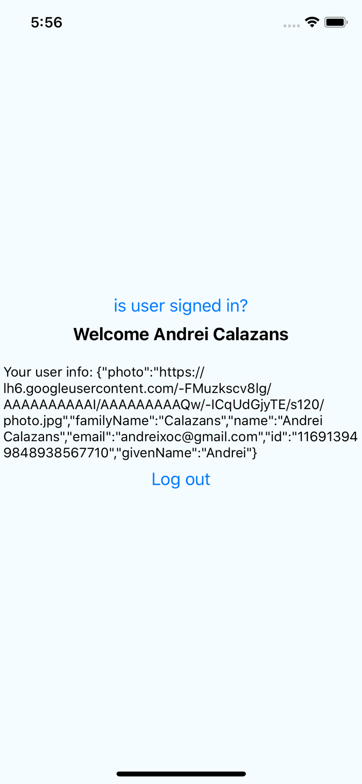
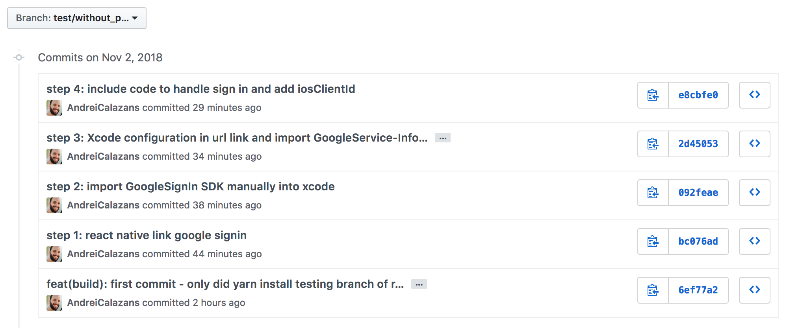

# TestGoogleSignin
_Example of displaying how to install [react-native-google-signin](https://github.com/react-native-community/react-native-google-signin) package_
___

### Installation examples:
_This repo has installation process for iOS and Android_

**iOS**
    : [x] With cocoapods
      [x] Without cocoapods

Android 
    : [ ] Gradlew

_Note: Each installation branch was carefully commited to follow the installation guide, you can check it to compare to your local results and what changes on each step._

